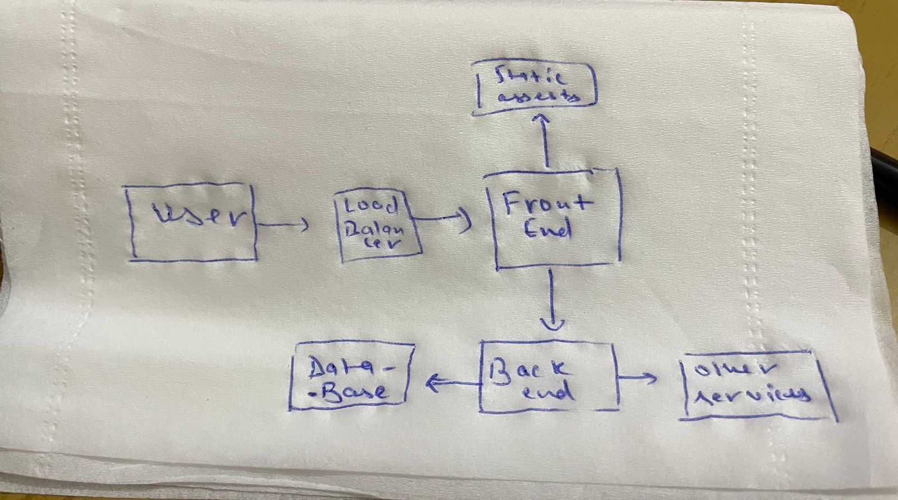
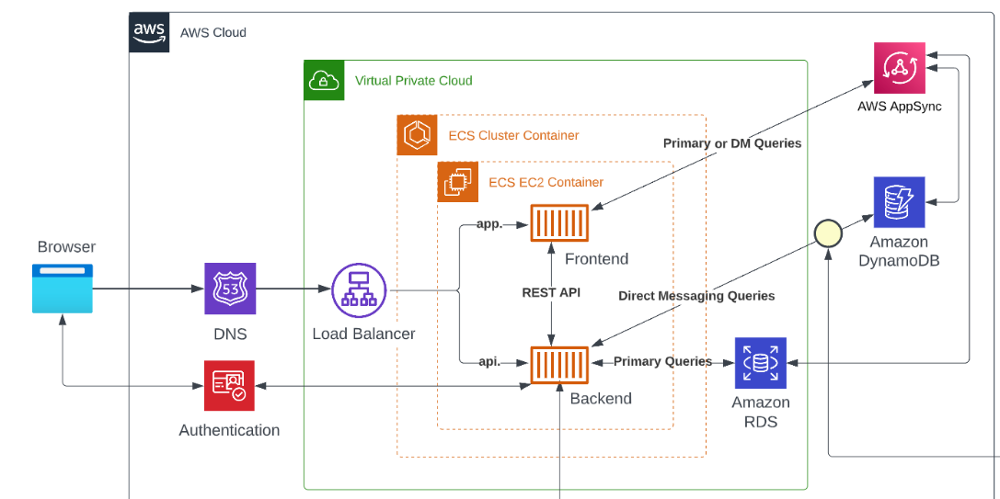

# Week 0 — Billing and Architecture

## Recreate Conceptual Diagram on a Napkin

Created a very simple architecture on a napkin.

## Recreate Logical Architectual Diagram in Lucid Charts

## Create a budget

Created an AWS Zero spend budget with my Name.

## Create an Alarm

Created an Billing Alarm which triggers when Charges Exceed $0.1.

